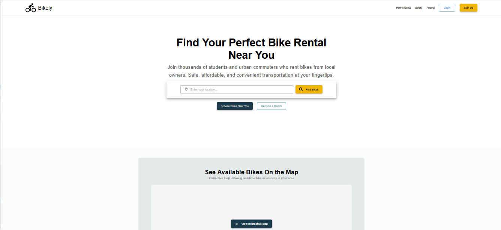

# Bikely - PLP Mern Final Project
- Connecting riders to bicycles, one pedal at a time.
Visit: [https://bikely-app.vercel.app/](https://bikely-app.vercel.app/)


## Project Structure
```
Bikely/
├── Frontend/               # React Frontend
│   ├── components/
│   ├── assets/
│   ├── context/
│   ├── pages/
│   └── App.jsx
├── Backend/               # Express Backend
│   ├── routes/
│   ├── controllers/
│   ├── middleware/
│   └── models/
└── README.md
```

## Features
- Login/Register
- Upload Bikes for rent
- Booking System Implemented
- Auto Receipt Generation